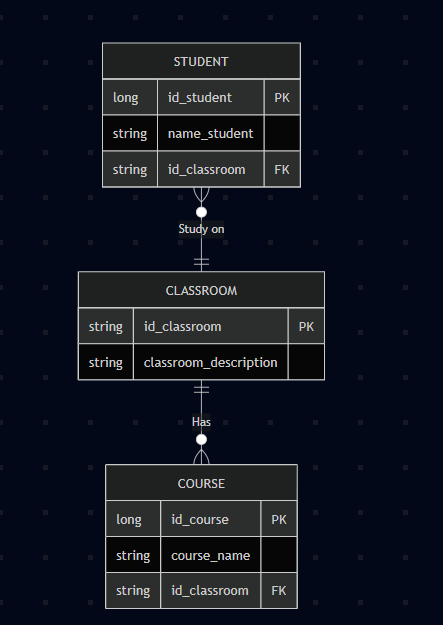

# Ejercicio de Normalización de Base de Datos

## Descripción

Este ejercicio tiene como objetivo practicar la normalización de una base de datos relacional siguiendo las **formas normales** (1NF, 2NF y 3NF). Se parte de una tabla inicial que contiene información sobre estudiantes, aulas y cursos, donde se observan redundancias y grupos repetitivos.

## Normalización de la tabla

## Diagrama de Chen

## Diagrama de patas de gallo

